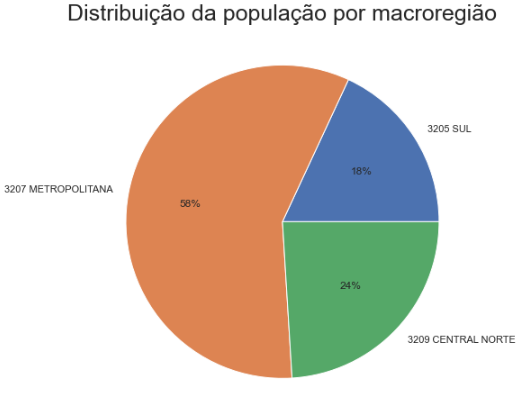
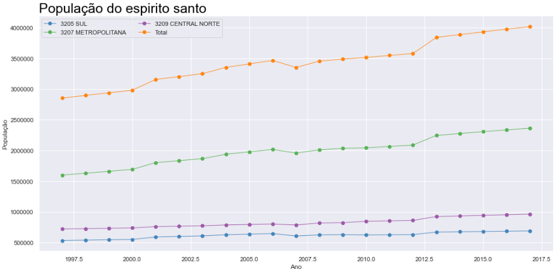
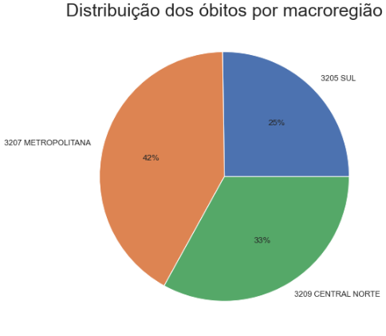

# Descritiva dos dados de desnutrição divididos em macrorregiões

Aluno: João Paulo de Paiva Holz
 
Professor: Ivan Robert Enriquez Guzman
 
Materia: Laboratorio de estatistica  

---
Foi escolhido Desnutrição como grupo cid-10. A decisão de escolha desse grupo foi por conta de sua relevancia em metricas de saude globais.
Seguindo o pedido no exercicio filtrei até 15 anos. Pegando todas faixas a abaixo.

## Distribuição da população

Abaixo vemos a distribuição da população no Espirito Santo. Com quase 60% na região metropolitana ou grande Vitória, 18 na região sul e 24% na região centro norte, mais próxima com a Bahia. Sabemos que mais de 50% da população vive em Vitória então vemos os dados mostrando corpo.
 
 

 
 
 
 
 
 
 
 
---

## Evolução da população

Abaixo vemos o crescimento populacional ao longo dos anos. Vemos que o total de 2020 vamos chegando em 4 milhões de habitantes no estado.
 

### Taxa de Crescimento Populacional

Calculei de 2 maneiras o crescimento populacional. A primeira foi utilizando apenas a virada de 2016 para 2017, pois o exercicio sugeria a utilização de 2017 como base para previsão. O que parece mais coerente com os tempos modernos, mas vemos que as taxas não variam muito a baixo

Região|Taxa de Crescimento Geo|Taxa de Crescimento 2017
---|---|---
3205 SUL           |1.01228|1.00672
3207 METROPOLITANA| 1.01878|1.01216
3209 CENTRAL NORTE| 1.01393|1.01012
Total|              1.01642|1.01074

---

### Crescimento Populacional Estimado

ANO|3205 SUL|3207 METROPOLITANA|3209 CENTRAL NORTE|TOTAL
---|---|---|---|---
2018|694 849.98|2 391 340.37|973 298.76|4 059 472.95
2019|699 521.16|2 420 428.31|983 152.28|4 103 052.79
2020|704 223.74|2 449 870.07|993 105.56|4 147 100.47
2021|708 957.93|2 479 669.95|1 003 159.60|4 191 621.02

### Real para compararmos

Vemos que é proximo porem a previsão joga os numeros um pouco pra cima

ANO|3205 SUL|3207 METROPOLITANA|3209 CENTRAL NORTE|TOTAL
---|---|---|---|---
2018|673658|2347633|951097|3972388
2019|678071|2379133|961446|4018650

## Desnutrição Grupo CID-10
Vemos abaixo como os casos estão distribuidos nas macrorregiões. Com 42% sendo na grande vitoria. O que nós faz perceber que mesmo tendo 60% da população ela apresenta 40% dos casos. Mostrando estar a frente na luta contra a desnutrição.  
25% dos casos são da região sul, bem proximo dos 20% mas ainda sim acima. E o centro norte com 33%, tambem maior que 24% que é sua população.
 

 
 
 
 
 
 
 
 
 
 

## Evolução dos Óbitos por desnutrição

Como o combate a desnutrição paulatinamente veio sendo palco de discussões e nas metricas de saúde vemos declinar rapidamente para 0, e esperamos que chegue a 0 nos próximos anos.
 

## Numero previsto de obtos pela taxa de ocorrência
ANO|3205 SUL|3207 METROPOLITANA|3209 CENTRAL NORTE
---|---|---|---
2018|1.05390| 1.53399| 1.03789
2019|1.06099| 1.55265| 1.04840
2020|1.06812| 1.57154| 1.05901
2021|1.07530| 1.59065| 1.06973

## Real
3205 SUL|3207 METROPOLITANA|3209 CENTRAL NORTE|	Total
---|---|---|---
2014| 1| 2| 1| 4
2015| 1| 0| 3| 4
2016| 1| 0| 0| 1
2017| 1| 2| 1| 4
2018| 1| 1| 1| 3
2019| 1| 3| 1| 5
2020| 0| 1| 1| 2

----

## Conclusão
Conseguimos concluir que a desnutrição esta sendo bem combatida e reduzindo a cada dia. Utilizando as taxas conseguimos "estimar" que teriamos 10 mortes em 2018,2019 e 2020 juntos, e nó final chegamos ao mesmo resultado. 
Conseguimos ver que a região metropolitana conseguiu diminui com mais rapidez tal problema, vemos tambem que o crescimento populacional pode estar comprometido por migrações dos residentes para outros estados.

 

---

