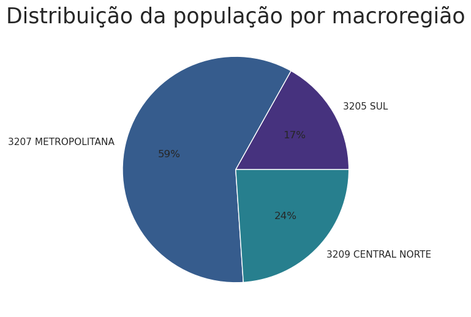
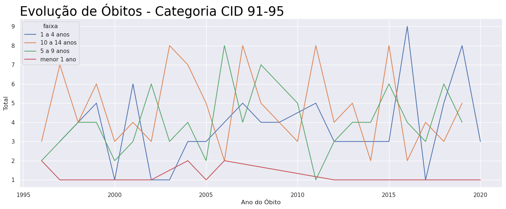
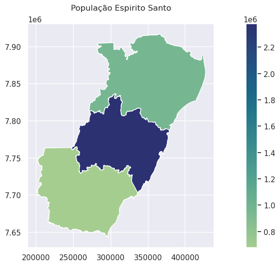
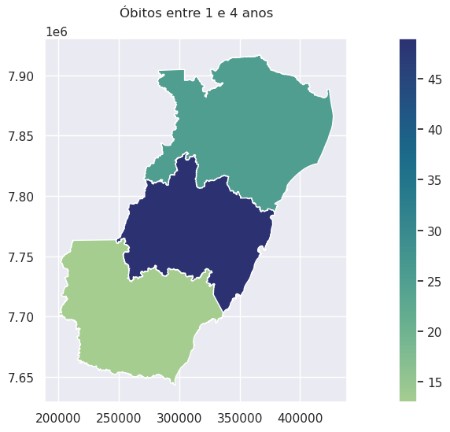
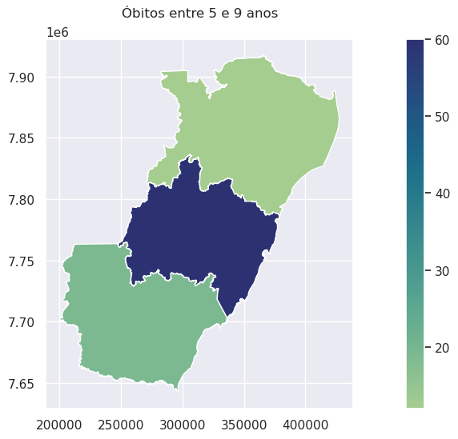
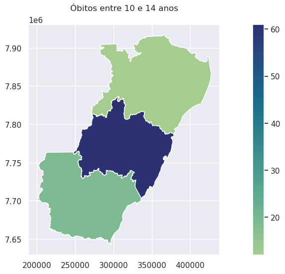
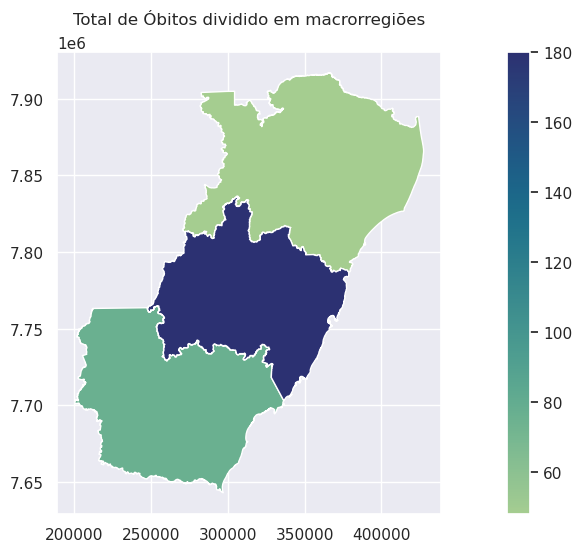

# Descritiva dos dados de desnutrição divididos em macroregiões

Aluno: João Paulo de Paiva Holz    
Professor: Ivan Robert Enriquez Guzman  
Materia: Laboratorio de estatistica   
Categoria de cid: Cid 91-95

### Importando as bibliotecas que iremos utilizar


```python
import pandas as pd
import matplotlib.pyplot as plt
import seaborn as sns
import numpy as np

sns.set()
plt.rcParams['figure.figsize'] = [17, 6]
```

## Juntando os dados


```python
dfmenor1 = pd.read_csv('menor1ano.csv',';')
dfmenor1 = dfmenor1.replace('-',0)
dfmenor1['faixa'] = 'menor 1 ano'

df1a4 = pd.read_csv('1a4anos.csv',';')
df1a4['faixa'] = '1 a 4 anos'
df1a4 = df1a4.replace('-',0)

df5a9 = pd.read_csv('5a9.csv',';')
df5a9['faixa'] = '5 a 9 anos'
df5a9 = df5a9.replace('-',0)

df10a15 = pd.read_csv('10a15.csv',';')
df10a15['faixa'] = '10 a 14 anos'
df10a15 = df10a15.replace('-',0)


pop = pd.read_csv('popu.csv',';')
colnames = pop.iloc[:,0]
pop = pop.transpose().iloc[5:]
pop.columns = colnames
pop = pop.apply(pd.to_numeric)
pop = pop.reset_index()

df = pd.concat([dfmenor1,df1a4,df5a9,df10a15])
df = df.drop(df[df['Ano do Óbito']=='Total'].index) 
df = df.replace('-',0)

df['Ano do Óbito'] = pd.to_numeric(df['Ano do Óbito'])
df['3205 SUL'] = pd.to_numeric(df['3205 SUL'])
df['3207 METROPOLITANA']=pd.to_numeric(df['3207 METROPOLITANA'])
df['3209 CENTRAL NORTE']=pd.to_numeric(df['3209 CENTRAL NORTE'])
df['Total']=pd.to_numeric(df['Total'])
```

    /tmp/ipykernel_6728/3860119622.py:1: FutureWarning: In a future version of pandas all arguments of read_csv except for the argument 'filepath_or_buffer' will be keyword-only.
      dfmenor1 = pd.read_csv('menor1ano.csv',';')
    /tmp/ipykernel_6728/3860119622.py:5: FutureWarning: In a future version of pandas all arguments of read_csv except for the argument 'filepath_or_buffer' will be keyword-only.
      df1a4 = pd.read_csv('1a4anos.csv',';')
    /tmp/ipykernel_6728/3860119622.py:9: FutureWarning: In a future version of pandas all arguments of read_csv except for the argument 'filepath_or_buffer' will be keyword-only.
      df5a9 = pd.read_csv('5a9.csv',';')
    /tmp/ipykernel_6728/3860119622.py:13: FutureWarning: In a future version of pandas all arguments of read_csv except for the argument 'filepath_or_buffer' will be keyword-only.
      df10a15 = pd.read_csv('10a15.csv',';')
    /tmp/ipykernel_6728/3860119622.py:18: FutureWarning: In a future version of pandas all arguments of read_csv except for the argument 'filepath_or_buffer' will be keyword-only.
      pop = pd.read_csv('popu.csv',';')


```python
df
```


<div>
<style scoped>
    .dataframe tbody tr th:only-of-type {
        vertical-align: middle;
    }

    .dataframe tbody tr th {
        vertical-align: top;
    }

    .dataframe thead th {
        text-align: right;
    }
</style>
<table border="1" class="dataframe">
  <thead>
    <tr style="text-align: right;">
      <th></th>
      <th>Ano do Óbito</th>
      <th>3205 SUL</th>
      <th>3207 METROPOLITANA</th>
      <th>3209 CENTRAL NORTE</th>
      <th>Total</th>
      <th>faixa</th>
    </tr>
  </thead>
  <tbody>
    <tr>
      <th>0</th>
      <td>1996</td>
      <td>1</td>
      <td>1</td>
      <td>0</td>
      <td>2</td>
      <td>menor 1 ano</td>
    </tr>
    <tr>
      <th>1</th>
      <td>1997</td>
      <td>0</td>
      <td>1</td>
      <td>0</td>
      <td>1</td>
      <td>menor 1 ano</td>
    </tr>
    <tr>
      <th>2</th>
      <td>2000</td>
      <td>0</td>
      <td>1</td>
      <td>0</td>
      <td>1</td>
      <td>menor 1 ano</td>
    </tr>
    <tr>
      <th>3</th>
      <td>2002</td>
      <td>0</td>
      <td>1</td>
      <td>0</td>
      <td>1</td>
      <td>menor 1 ano</td>
    </tr>
    <tr>
      <th>4</th>
      <td>2004</td>
      <td>1</td>
      <td>1</td>
      <td>0</td>
      <td>2</td>
      <td>menor 1 ano</td>
    </tr>
    <tr>
      <th>...</th>
      <td>...</td>
      <td>...</td>
      <td>...</td>
      <td>...</td>
      <td>...</td>
      <td>...</td>
    </tr>
    <tr>
      <th>19</th>
      <td>2015</td>
      <td>2</td>
      <td>4</td>
      <td>2</td>
      <td>8</td>
      <td>10 a 14 anos</td>
    </tr>
    <tr>
      <th>20</th>
      <td>2016</td>
      <td>1</td>
      <td>1</td>
      <td>0</td>
      <td>2</td>
      <td>10 a 14 anos</td>
    </tr>
    <tr>
      <th>21</th>
      <td>2017</td>
      <td>0</td>
      <td>4</td>
      <td>0</td>
      <td>4</td>
      <td>10 a 14 anos</td>
    </tr>
    <tr>
      <th>22</th>
      <td>2018</td>
      <td>1</td>
      <td>1</td>
      <td>1</td>
      <td>3</td>
      <td>10 a 14 anos</td>
    </tr>
    <tr>
      <th>23</th>
      <td>2019</td>
      <td>2</td>
      <td>2</td>
      <td>1</td>
      <td>5</td>
      <td>10 a 14 anos</td>
    </tr>
  </tbody>
</table>
<p>82 rows × 6 columns</p>
</div>


## Group By
Fazendo um simples group by vemos abaixo a tabela cruzada de faixa etaria x macrorregião.


```python
group.iloc[:,1:]
```


<div>
<style scoped>
    .dataframe tbody tr th:only-of-type {
        vertical-align: middle;
    }

    .dataframe tbody tr th {
        vertical-align: top;
    }

    .dataframe thead th {
        text-align: right;
    }
</style>
<table border="1" class="dataframe">
  <thead>
    <tr style="text-align: right;">
      <th></th>
      <th>3205 SUL</th>
      <th>3207 METROPOLITANA</th>
      <th>3209 CENTRAL NORTE</th>
      <th>Total</th>
    </tr>
    <tr>
      <th>faixa</th>
      <th></th>
      <th></th>
      <th></th>
      <th></th>
    </tr>
  </thead>
  <tbody>
    <tr>
      <th>1 a 4 anos</th>
      <td>13</td>
      <td>49</td>
      <td>25</td>
      <td>87</td>
    </tr>
    <tr>
      <th>10 a 14 anos</th>
      <td>19</td>
      <td>61</td>
      <td>29</td>
      <td>109</td>
    </tr>
    <tr>
      <th>5 a 9 anos</th>
      <td>12</td>
      <td>60</td>
      <td>20</td>
      <td>92</td>
    </tr>
    <tr>
      <th>menor 1 ano</th>
      <td>4</td>
      <td>10</td>
      <td>2</td>
      <td>16</td>
    </tr>
  </tbody>
</table>
</div>


---
Vemos que a região metropolitava consiste da maioria da população como já se é esperado


```python
_ = plt.pie(pop.iloc[-1,1:4],labels=['3205 SUL', '3207 METROPOLITANA', '3209 CENTRAL NORTE'],autopct='%.0f%%')
_ = plt.title('Distribuição da população por macroregião',fontsize=25)
```


    

    


## Distribuição dos obitos por macroregião


```python
_ = plt.pie(df.sum()[1:4],labels=['3205 SUL', '3207 METROPOLITANA', '3209 CENTRAL NORTE'],autopct='%.0f%%')
_ = plt.title('Distribuição dos óbitos por macroregião',fontsize=25)
```


    

    


```python
group = df.groupby(['faixa']).sum()
_ = plt.pie(group['Total'],labels=group.index,autopct='%.0f%%')
_ = plt.title('Distribuição dos óbitos por Faixa Etaria',fontsize=25)
```


    

    


Vemos que a maioria dos óbitos se encontra entre 10 e 14 anos. E vemos que menos de 1 ano é a menor proporção com apenas 5%. 
  
O que é um bom indício

---

# Series Historicas

Nas series historicas vemos a população do espirito santo chegando a quase 4 milhões de pessoas.
As series historicas dos Cids parecem estar estacionarias, onde nas idades mais baixas existem menos óbitos e nas idades mais altas vemos mais mortes.


```python
def plot_lines(df,
               xcol = 'index',
               title = "População do espirito santo",
               xlab = "Ano",
               ylab = "População"):
    palette = plt.get_cmap('Set1')
    num=0
    for column in df.columns[df.columns!=xcol]:
        num+=1
        plt.plot(df[xcol], df[column], marker='o', color=palette(num), linewidth=1, alpha=0.9, label=column)
    plt.legend(loc=2, ncol=2)
    plt.title(title, loc='left', fontsize=25, fontweight=0, color='Black')
    plt.xlabel(xlab)
    plt.ylabel(ylab)
    plt.yscale('linear')
    plt.ticklabel_format(style='plain', axis='y', scilimits=(0,0))
    plt.show()
```

## Serie historica do crescimento populacional do Espirito Santo


```python
plot_lines(pop,xcol='index')
```


    

    


```python
df_plot = dfmenor1.drop('faixa',axis=1)
df_plot.index = df_plot['Ano do Óbito']
df_plot = df_plot.drop('Ano do Óbito',axis=1)
df_plot = df_plot.iloc[:-1,:]
df_plot = df_plot.apply(pd.to_numeric)
df_plot = df_plot.reset_index()
df_plot = df_plot.apply(pd.to_numeric)
df_plot2 = pd.DataFrame(np.arange(1996,2020))
df_plot2.columns = ['ano']
df_plot2 = df_plot2.apply(pd.to_numeric)
teste = df_plot.merge(df_plot2,how='right',right_on='ano',left_on='Ano do Óbito')
teste = teste.replace(np.NaN,0)
plot_lines(teste.iloc[:,1:],xcol = 'ano',title= 'cid 91-95 - Menor que 1 Ano')
```


    

    


```python
df_plot = df1a4.drop('faixa',axis=1)
df_plot.index = df_plot['Ano do Óbito']
df_plot = df_plot.drop('Ano do Óbito',axis=1)
df_plot = df_plot.iloc[:-1,:]
df_plot = df_plot.apply(pd.to_numeric)
df_plot = df_plot.reset_index()
df_plot = df_plot.apply(pd.to_numeric)
df_plot2 = pd.DataFrame(np.arange(1996,2020))
df_plot2.columns = ['ano']
df_plot2 = df_plot2.apply(pd.to_numeric)
teste = df_plot.merge(df_plot2,how='right',right_on='ano',left_on='Ano do Óbito')
teste = teste.replace(np.NaN,0)
plot_lines(teste.iloc[:,1:],xcol = 'ano',title= 'cid 91-95 - 1 a 4 anos')
```


    

    


```python
df_plot = df5a9.drop('faixa',axis=1)
df_plot.index = df_plot['Ano do Óbito']
df_plot = df_plot.drop('Ano do Óbito',axis=1)
df_plot = df_plot.iloc[:-1,:]
df_plot = df_plot.apply(pd.to_numeric)
df_plot = df_plot.reset_index()
df_plot = df_plot.apply(pd.to_numeric)
df_plot2 = pd.DataFrame(np.arange(1996,2020))
df_plot2.columns = ['ano']
df_plot2 = df_plot2.apply(pd.to_numeric)
teste = df_plot.merge(df_plot2,how='right',right_on='ano',left_on='Ano do Óbito')
teste = teste.replace(np.NaN,0)
plot_lines(teste.iloc[:,1:],xcol = 'ano',title= 'cid 91-95 - Entre 5 a 9 anos')
```


    

    


```python
df_plot = df10a15.drop('faixa',axis=1)
df_plot.index = df_plot['Ano do Óbito']
df_plot = df_plot.drop('Ano do Óbito',axis=1)
df_plot = df_plot.iloc[:-1,:]
df_plot = df_plot.apply(pd.to_numeric)
df_plot = df_plot.reset_index()
df_plot = df_plot.apply(pd.to_numeric)
df_plot2 = pd.DataFrame(np.arange(1996,2020))
df_plot2.columns = ['ano']
df_plot2 = df_plot2.apply(pd.to_numeric)
teste = df_plot.merge(df_plot2,how='right',right_on='ano',left_on='Ano do Óbito')
teste = teste.replace(np.NaN,0)
plot_lines(teste.iloc[:,1:],xcol = 'ano',title= 'cid 91-95 - Entre 10 a 14 anos')
```


    

    


```python
newdf = pd.DataFrame(df.groupby(['faixa','Ano do Óbito']).sum()['Total']).reset_index()
_ = sns.lineplot(x = newdf['Ano do Óbito'],y=newdf['Total'],hue = newdf['faixa'])
_ = plt.title('Evolução de Óbitos - Categoria CID 91-95 ', loc='left', fontsize=25, fontweight=0, color='Black')
```


    

    


# Plot Espirito Santo


```python
import geopandas as gpd
```


```python
x = gpd.read_file('Lim_Macrorregiao.shp')
x = x[x.nome!='Norte']
```


```python
x
```


<div>
<style scoped>
    .dataframe tbody tr th:only-of-type {
        vertical-align: middle;
    }

    .dataframe tbody tr th {
        vertical-align: top;
    }

    .dataframe thead th {
        text-align: right;
    }
</style>
<table border="1" class="dataframe">
  <thead>
    <tr style="text-align: right;">
      <th></th>
      <th>nome</th>
      <th>areaKm2</th>
      <th>fonte</th>
      <th>data</th>
      <th>origem</th>
      <th>geometry</th>
    </tr>
  </thead>
  <tbody>
    <tr>
      <th>0</th>
      <td>Central</td>
      <td>12241.138658</td>
      <td>CGEO/IJSN</td>
      <td>Dezembro de 2011</td>
      <td>Lei 9.768 de 28/12/2011</td>
      <td>POLYGON ((284754.572 7843508.373, 284756.138 7...</td>
    </tr>
    <tr>
      <th>1</th>
      <td>Sul</td>
      <td>10344.980138</td>
      <td>CGEO/IJSN</td>
      <td>Dezembro de 2011</td>
      <td>Lei 9.768 de 28/12/2011</td>
      <td>POLYGON ((253980.461 7764750.189, 253984.403 7...</td>
    </tr>
    <tr>
      <th>3</th>
      <td>Metropolitana</td>
      <td>9105.799425</td>
      <td>CGEO/IJSN</td>
      <td>Dezembro de 2011</td>
      <td>Lei 9.768 de 28/12/2011</td>
      <td>POLYGON ((336469.406 7703048.167, 334095.567 7...</td>
    </tr>
  </tbody>
</table>
</div>


```python
pop.iloc[-1,:]
```


    Macrorregião de Saúde
    index                    2019
    3205 SUL               678071
    3207 METROPOLITANA    2379133
    3209 CENTRAL NORTE     961446
    Total                 4018650
    Name: 22, dtype: object


```python
x['value'] = [961446,678071,2379133]
_ = x.plot(x['value'],cmap="crest",legend=True)
_ = plt.title('População Espirito Santo',pad=20)
```


    

    


```python
x['value'] = [25,13,49]
_ = x.plot(x['value'],cmap="crest",legend=True)
_ = plt.title('Óbitos entre 1 e 4 anos',pad=20)
```


    

    


```python
x['value'] = [2,4,10]
_ = x.plot(x['value'],cmap="crest",legend=True)
_ = plt.title('Óbitos menores que 1 ano',pad=20)
```


    

    


```python
x['value'] = [12,19,60]
_ = x.plot(x['value'],cmap="crest",legend=True)
_ = plt.title('Óbitos entre 5 e 9 anos',pad=20)
```


    

    


```python
x['value'] = [12,19,61]
_ = x.plot(x['value'],cmap="crest",legend=True)
_ = plt.title('Óbitos entre 10 e 14 anos',pad=20)
```


    

    


```python
x['value'] = [48,76,180]
_ = x.plot(x['value'],cmap="crest",legend=True)
_ = plt.title('Total de Óbitos dividido em macrorregiões',pad=20)
```


    

    

